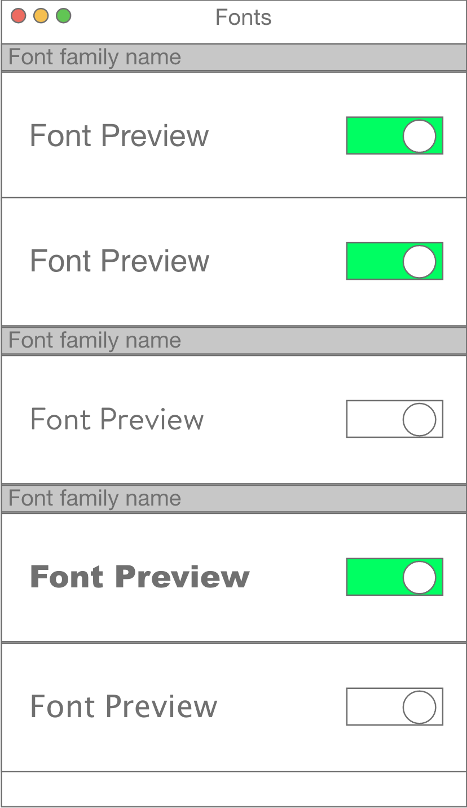

# macOS App

This is the client app for macOS. Currently the app and it's code sits in `/Mac app/`.

### Implimentation

The client app is a Swift Catalyst app. The reason for that is I'm just more familiar with the UIKit API than I am with AppKit.
The general idea of this application is there will be a list of fonts with a toggle switch in each cell. The toggle switch is set to
"Off"(`false`) by default and can be turned "On"(`true`) when toggled. When toggling the switch to "On" that will invoke a function to
download the font file and store it in the `/Library/Fonts/` folder on the Mac. When the toggle is switched to "Off" the switch will then
invoke a function to delete the font from the `/Library/Fonts/` folder.

The fonts in the list will be broken up by sections defined by a font family. Under each section will be the fonts associated with the font family
and it's toggle switch.

Example mockup:

    

