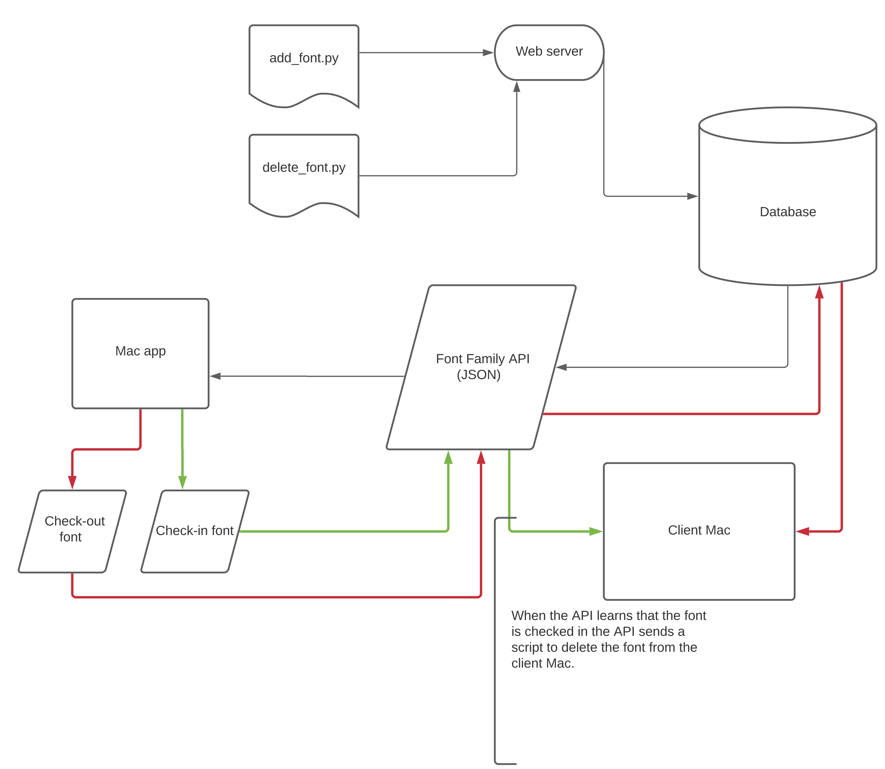

# Font Manager

Repo for an attempted* font manager server and client applications. It is currently set as open sourced and I would like to keep that way. 

For implementation thoughts and some details about it, check the Documentation folder for:
* font_client.md
* font_server.md

If this actually works then remove "attempted" 😅.

### Workflow

Below is a quick diagram of the whole workflow of this system as it stands currently. This is, of course, open for modification.

